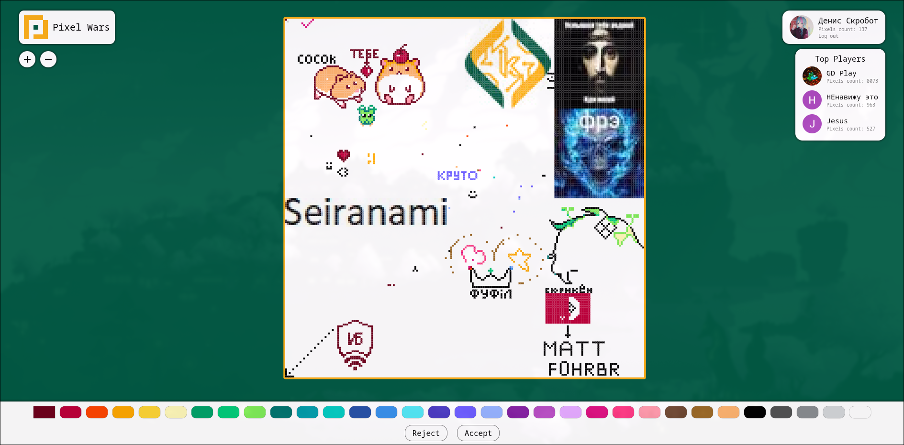

# Pixel Wars



**Pixel Wars** is a multiplayer game inspired by [r/place](https://www.reddit.com/r/place/). It provides an interface that allows users to interact with other players on the same map in real time.

The project is built with the **Spring Framework** and uses a **PostgreSQL** database. Authentication is handled via **Google OAuth 2.0**. For a more detailed description of the project, see the [report](report/course.pdf).

## Usage

### Configure

Create a file named `.env` and paste your credentials.

```shell
DB_USERNAME=
DB_PASSWORD=

ADMIN_EMAIL=
ADMIN_PASSWORD=

OAUTH_CLIENT_ID=
OAUTH_CLIENT_SECRET=
```

### Docker Compose

```shell
docker-compose up --build -d
```

After that, open [`localhost`](http://localhost) in your browser.

Additionally, you can change some settings in the [`application.properties`](src/main/resources/application.properties) file.

### Manual

This project requires [Maven](https://maven.apache.org/) as the build tool.

```shell
mvn clean package
```

```shell
java -jar target/<package>.jar
```

## License

[MIT © Denis Skrobot](LICENSE)